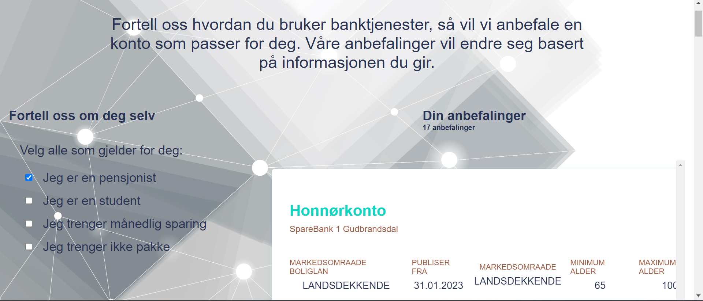

# Getting Started with Create React App

This project was bootstrapped with [Create React App](https://github.com/facebook/create-react-app).

## Available Scripts

In the project directory, you can run:

### `npm start`

Runs the app in the development mode.\
Open [http://localhost:3000](http://localhost:3000) to view it in the browser.

The page will reload if you make edits.\
You will also see any lint errors in the console.

## Table of contents

- [Overview](#overview)
  - [The challenge](#the-challenge)
  - [Screenshot](#screenshot)  
- [My process](#my-process)
  - [Built with](#built-with)
  - [My Decisions and assumptions](#my-decisions-and-assumptions)
  - [Continued development](#continued-development)
  

## Overview

### The challenge

 create a simple web application that displays the data and guides users to which account suits them best

### Screenshot

## My process

### Built with

- [React](https://reactjs.org/) - JS library
- [Typescript](https://www.typescriptlang.org/) - Javascript with syntax for types
- [Next.js](https://nextjs.org/) - React framework
- [Styled Components](https://styled-components.com/) - For styles
- [xml2js](https://www.npmjs.com/package/xml2js#node-xml2js) - XML to Javascript object converter

### My decisions and assumptions

- I decided to create a single page application
- I tried to learn the data from Finansportalen. But didn't understand fully. So I decided to create a model which shows information irrespective of whether the information is important or not.
- I tried to make the components reusable and accessible.

### Continued development
If I get more time

- I would make the website responsive.
- I would try to show more information from the data by adding a modal or changing the height of the container which carries the information.
- I would learn the data and gather more information and will add a feature that enables the user to fill in the current bank account details and gets an insight into how much money can be saved by switching to a better account.
- I would try to add a chatbot.

